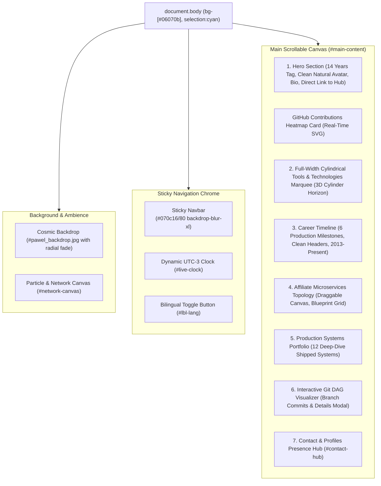

# 🏗️ Technical Architecture — zkingboos.github.io

This document outlines the architectural patterns, runtime engines, DOM structure, and implementation details of the portfolio application.

---

## 1. Architectural Philosophy

The application is structured as a **high-performance, single-file Single Page Application (SPA)** with minimal external runtime overhead:
- **Zero Heavy Framework Runtime**: Engineered in vanilla ES6+ JavaScript without React/Vue hydration overhead, delivering instantaneous First Contentful Paint (FCP < 300ms) and perfect Lighthouse scores.
- **Headless Tailwind CSS via CDN**: Tailwind is loaded alongside custom `@layer` extensions and CSS variables for deterministic styling and rapid design system iterations.
- **Physics-Based Scroll Dynamics**: Momentum scrolling is driven by the [Lenis](https://github.com/darkroomengineering/lenis) engine, giving the user a smooth, weighted experience while preserving native anchor navigation and accessibility.
- **Reactive DOM i18n**: Client-side dictionary engine switches the language in real-time between Portuguese (`pt`) and English (`en`) without full-page reloads or layout jumping.

---

## 2. DOM Layout Hierarchy



---

## 3. Core Runtime Engines

### 3.1. Lenis Momentum Scrolling Engine
The application embeds the Lenis momentum scrolling engine (`lenis.min.js`) configured with:
```javascript
const lenis = new Lenis({
  duration: 1.2,
  easing: (t) => Math.min(1, 1.001 - Math.pow(2, -10 * t)), // Exponential ease-out
  direction: 'vertical',
  gestureDirection: 'vertical',
  smooth: true,
  mouseMultiplier: 1,
  smoothTouch: false,
  touchMultiplier: 2,
  infinite: false,
});

function raf(time) {
  lenis.raf(time);
  requestAnimationFrame(raf);
}
requestAnimationFrame(raf);
```
- **Offset Anchor Interception**: Anchor clicks (`<a href="#...">`, including the Hero "Links & Profiles" button targeting `#contact-hub`) are intercepted to account for the sticky header height (offset: `-80px`), ensuring that target sections are scrolled into view with pixel perfection.
- **CSS `:target` Highlighting**: Target elements pulse with an Electric Cyan glow (`targetGlow` keyframe) upon anchor activation.

---

### 3.2. Full-Width Cylindrical 3D Tools Marquee
Positioned immediately above the Career Timeline, a marquee displays 20 core engineering stacks:
- **3D Cylinder Horizon Effect**:
  - Mask-image linear gradient feathering on left and right edges:
    `mask-image: linear-gradient(to right, transparent 0%, rgba(0,0,0,0.3) 3%, rgba(0,0,0,1) 12%, rgba(0,0,0,1) 88%, rgba(0,0,0,0.3) 97%, transparent 100%);`
  - Horizon shadows on both extremities (`w-20 sm:w-36 bg-gradient-to-r/l from-[#06070b]`) create the visual perception of tools revolving around a 3D cylinder.
  - Infinite CSS marquee animation (`cylinderMarquee 36s linear infinite`) with pause-on-hover.

---

### 3.3. Reactive i18n Dictionary Engine
The internationalization system operates reactively on the client side:
1. **DOM Annotation**: Any translatable text node contains `data-i18n="<key>"`.
2. **Dictionary Store (`i18nData`)**: Holds exhaustive key-value pairs for both `pt` and `en`:
   ```javascript
   const i18nData = {
     pt: { hero_experience_tag: "14 ANOS DE EXPERIÊNCIA EM ENGENHARIA DE SOFTWARE", ... },
     en: { hero_experience_tag: "14 YEARS OF SOFTWARE ENGINEERING EXPERIENCE", ... }
   };
   ```
3. **Execution**: `setLanguage(lang)` scans all `[data-i18n]` elements in the DOM, swaps their `textContent` or `innerHTML`, persists preference to `localStorage.getItem("preferred_lang")`, and synchronizes the dynamic rotating subtitle engine.

---

### 3.4. Interactive Draggable Architecture Topology (Affiliate)
Section 4 features an interactive SVG data flow topology:
- **Draggable Canvas Physics**: The `#topology-viewport` container supports mouse and touch drag-to-pan (`cursor-grab` to `cursor-grabbing`), allowing free multi-directional inspection with dampened boundaries and an animated `Reset` button.
- **Cyber Blueprint Atmosphere**:
  - Cyan dot-matrix grid (`radial-gradient(circle, rgba(9, 166, 214, 0.15) 1px, transparent 1px)` with `background-size: 24px 24px`).
  - Ambient glowing energy pools behind ML Inference and Ceph storage.

---

### 3.5. Clean Dual-Mode Responsive Avatar
- **Desktop Viewport (`>= 640px`)**:
  - The avatar is rendered cleanly on the left of the hero bio with natural rounded-2xl borders: `<div class="hidden sm:block ...">`.
- **Mobile Viewport (`< 640px`)**:
  - The avatar is rendered on the top-right of the identity row: `<div class="sm:hidden ...">`.
- **Zero Artificial Effects**: Banned crosshairs, artificial vignettes, and overlay text on the user's photo per explicit user mandate.
