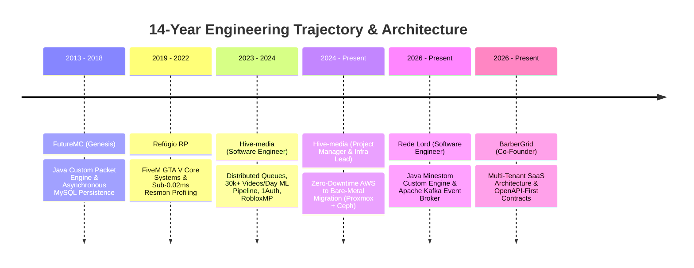

# 💼 Career & Systems Dossier — zkingboos.github.io

This document provides a comprehensive technical dossier of the **6 Career Milestones** and **12 Shipped Production Systems** built by **José Gabriel (`zkingboos`)**.

---

## 1. Career Timeline & Milestones (2013 — Present)

> **Trajectory Note**: José began self-directed software programming at **age 8**, building foundational network and packet architectures from an early age. The timeline below highlights 14 years of continuous technical evolution, from bare-metal Minecraft packet engines in 2013 to multi-tenant distributed cloud SaaS in 2026.

---

### Milestone 1: BarberGrid
- **Role**: Co-Founder
- **Period**: Jun 2026 — Present
- **Company**: BarberGrid
- **Focus**: Multi-tenant barbershop architecture & OpenAPI contracts
- **Key Responsibilities & Deliveries**:
  - Engineered the multi-tenant SaaS backend architecture from the ground up using **Go (Golang)**.
  - Instituted strict OpenAPI-first contracts between backend and client interfaces, ensuring deterministic API schemas and zero drift.
  - Implemented containerized microservice deployments via Docker with centralized observability and tracing.
- **Tech Stack**: `Go (Golang)`, `OpenAPI`, `Docker`, `PostgreSQL`, `Observability`.

---

### Milestone 2: Rede Lord
- **Role**: Software Engineer
- **Period**: Apr 2026 — Present
- **Company**: Rede Lord
- **Focus**: Java Minestom packet engine + Apache Kafka asynchronous broker
- **Key Responsibilities & Deliveries**:
  - Built a custom, high-throughput Minecraft server from scratch using **Java** and the **Minestom** packet-handling library, decoupling game logic from heavyweight legacy Bukkit implementations.
  - Integrated **ViaVersion** to guarantee multi-protocol backwards and forwards client compatibility.
  - Engineered an event-driven microservices mesh utilizing **Apache Kafka** for asynchronous pub/sub message brokering, connected to a high-speed HTTP/REST backend API in **Go (Fiber)**.
- **Tech Stack**: `Java`, `Minestom`, `Apache Kafka`, `Go (Fiber)`, `OpenAPI`, `Distributed Systems`.

---

### Milestone 3: Hive-media (Project Manager & Infra Lead)
- **Role**: Project Manager & Infra Lead
- **Period**: Jul 2024 — Present
- **Company**: Hive-media
- **Focus**: Zero-downtime AWS to bare-metal migration (Proxmox + Ceph)
- **Key Responsibilities & Deliveries**:
  - Architected and executed a full infrastructure migration from AWS to a dedicated on-premise bare-metal cluster running **Proxmox VE** and **Ceph** distributed object/block storage.
  - Slashed operational cloud infrastructure costs significantly while improving throughput and data sovereignty.
  - Automated bare-metal provisioning and network policies with **Terraform IaC** and mesh networking via **Tailscale**.
  - Defined architecture standards and supervised backend engineering for core company platforms including **Aventrada** and **Launchpaid**.
- **Tech Stack**: `Proxmox VE`, `Ceph Storage`, `Terraform`, `Tailscale`, `Hono`, `Bare-Metal Cloud`.

---

### Milestone 4: Hive-media (Software Engineer)
- **Role**: Software Engineer
- **Period**: Mar 2023 — Oct 2024
- **Company**: Hive-media
- **Focus**: Distributed queues (BullMQ/Redis) & 30k+ videos/day ML ingest pipeline
- **Key Responsibilities & Deliveries**:
  - Developed and maintained critical microservices, asynchronous queues, and automated data ingestion pipelines.
  - **Affiliate Pipeline**: Built an automated social media video monitoring system ingesting and processing over **30,000+ videos every single day** with machine learning validation (PyTorch/ONNX).
  - **1Auth**: Engineered an end-to-end zero-knowledge account management service with strict Role-Based Access Control (RBAC).
  - **RobloxMP**: Designed and launched a secure RMT (Real-Money Trading) marketplace with an in-house crypto payment gateway and automated escrow settlement.
- **Tech Stack**: `Node.js`, `TypeScript`, `Python`, `BullMQ`, `Redis`, `PostgreSQL`, `FastAPI`.

---

### Milestone 5: Refúgio RP
- **Role**: FiveM Systems Developer
- **Period**: 2019 — 2022
- **Company**: Refúgio RP
- **Focus**: Whitelist engine, admin moderation suite & sub-0.02ms resmon optimization
- **Key Responsibilities & Deliveries**:
  - Designed core gameplay systems and game-server networking for Refúgio RP, a high-concurrency FiveM (GTA V) roleplay community.
  - Created automated player onboarding and whitelist authentication integrated with Discord APIs and relational databases.
  - Implemented in-game administrative observation and anti-cheat telemetry tools.
  - Conducted extensive resource profiling using FiveM's Resmon, bringing tick-loop resource consumption down to **sub-0.02ms**, eliminating stutter under peak player loads (300+ concurrent players).
- **Tech Stack**: `Lua`, `JavaScript`, `Node.js`, `MySQL`, `FiveM FXServer`, `Resmon Profiler`.

---

### Milestone 6: FutureMC
- **Role**: Minecraft Systems Developer (Genesis)
- **Period**: 2013 — 2018
- **Company**: FutureMC
- **Focus**: Futuristic Minecraft server gameplay core & asynchronous MySQL persistence
- **Key Responsibilities & Deliveries**:
  - The origin of José's software engineering journey: engineered and operated gameplay mechanics, custom economy protocols, and backend systems for FutureMC in live production.
  - Designed modular object-oriented architectures in **Java**, handling raw network packet streams and protocol hacks.
  - Implemented asynchronous database pools in **MySQL** to prevent server-thread blocking during player data reads/writes.
- **Tech Stack**: `Java`, `MySQL`, `Spigot/Bukkit API`, `Packet Systems`, `Relational DB`.

---

## 2. Deep-Dive Shipped Production Systems (The 12 Systems)

| # | System Name | Scope & Engineering Focus | Primary Stack |
| :---: | :--- | :--- | :--- |
| **01** | **Affiliate Ingest Pipeline** | Ingestion pipeline processing 30,000+ daily videos via BullMQ, Redis, FFmpeg, and PyTorch ML inference. | `Node.js`, `BullMQ`, `Redis`, `Python`, `PyTorch`, `PostgreSQL` |
| **02** | **Rede Lord Core** | Custom Minecraft server engine built on Minestom with ViaVersion and Apache Kafka message brokering. | `Java`, `Minestom`, `Apache Kafka`, `Go (Fiber)` |
| **03** | **BarberGrid SaaS** | Multi-tenant SaaS platform with strict OpenAPI-first contracts and Dockerized microservices. | `Go (Golang)`, `OpenAPI`, `PostgreSQL`, `Docker` |
| **04** | **Hive-media Bare-Metal** | Migration from AWS to an on-premise Proxmox VE + Ceph distributed storage cluster. | `Proxmox VE`, `Ceph`, `Terraform`, `Tailscale` |
| **05** | **Aventrada** | High-concurrency event ticketing engine with distributed transactional locks (zero overbooking). | `TypeScript`, `Node.js`, `PostgreSQL`, `Redis` |
| **06** | **Launchpaid** | Creator monetization platform with automated split payments and audit logging. | `TypeScript`, `Hono`, `PostgreSQL`, `Stripe API` |
| **07** | **1Auth Platform** | Zero-knowledge identity platform with multi-tenant RBAC and encrypted session tokens. | `Kotlin`, `Ktor`, `PostgreSQL`, `Argon2` |
| **08** | **RobloxMP** | Real-money trading digital marketplace with custom cryptocurrency payment gateway and escrow. | `Node.js`, `TypeScript`, `Web3 / Crypto RPC`, `PostgreSQL` |
| **09** | **Refúgio RP Engine** | High-concurrency FiveM roleplay backend optimized for sub-0.02ms resource performance. | `Lua`, `Node.js`, `MySQL`, `FXServer` |
| **10** | **FutureMC Core** | Production server core with asynchronous network packet manipulation and relational persistence. | `Java`, `Spigot/Bukkit`, `MySQL`, `Custom Packets` |
| **11** | **Git DAG Visualizer** | Interactive client-side Directed Acyclic Graph commit visualizer embedded directly into the portfolio. | `Vanilla JavaScript`, `SVG`, `Tailwind CSS` |
| **12** | **Open-Source Tooling** | Developer utilities, CLI tools, and automation packages maintained on GitHub (`@zkingboos`). | `Go`, `TypeScript`, `Python`, `Bash` |
