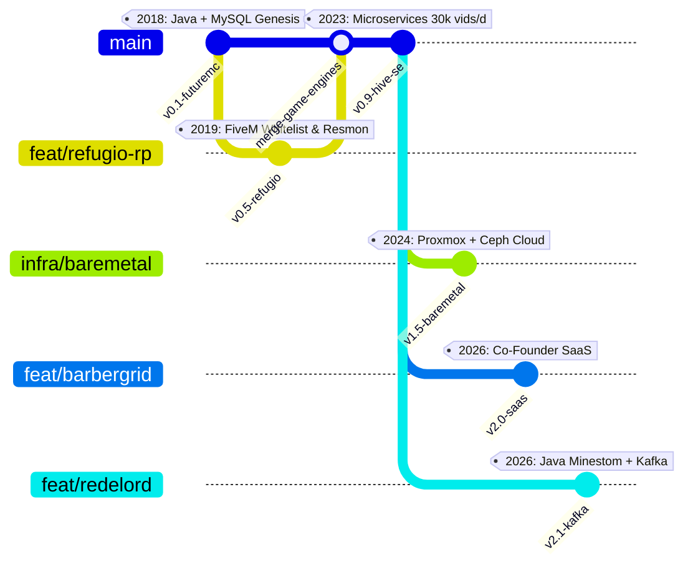

# Plano de Implementação: FASE 02 com Foco nos Favoritos (03. Git DAG & 04. Command Center) + Futuremc (2018–2022) & Refúgio RP (2019–2022)

## Goal Description
O usuário selecionou como **favoritos absolutos** os designs:
* **Opção 03: 🌳 Git DAG Visualizer (`git log --graph`)**
* **Opção 04: 🎛️ Command Center (Split Console / Master-Detail)**

E forneceu as datas exatas e o escopo detalhado das duas experiências fundacionais:
1. **Futuremc (2018 — 2022, ~4 anos de duração):** Servidor de Minecraft futurista onde iniciou o desenvolvimento de sistemas. Stack: **Java**, **MySQL**, manipulação de pacotes, persistência relacional e arquitetura de plugins orientada a objetos.
2. **Refúgio RP (2019 — 2022):** Cidade de FiveM (GTA V Roleplay). Atuação como desenvolvedor responsável pelo sistema de **Whitelist**, painéis administrativos/moderação in-game e **otimização rigorosa de uso de recursos** (resmon sub-0.02ms, redução de tick loop e profiling de memória).

Este plano detalha a incorporação completa dessas duas atuações em toda a Fase 02, com especial ênfase nas opções 03 e 04, além de adicionar suas respectivas fichas técnicas na seção **Shipped Systems** (`#project-futuremc` e `#project-refugiorp`).

---

## User Review Required

> [!IMPORTANT]
> **Ordem Cronológica e Paralelismo Temporal (2018 — 2026):**
> Entre **2019 e 2022**, Futuremc e Refúgio RP coexistiram ativamente no seu portfólio de engenharia!
> * No **Git DAG Visualizer (Opção 03)**, isso será representado visualmente de forma incrível: duas branches paralelas de engenharia de jogos e sistemas de socket/rede (`feat/futuremc-core` em Java e `feat/refugio-rp-fivem` em Lua/JS) que convergem na maturidade para os microsserviços da Hive-media em 2023!
> * No **Command Center (Opção 04)**, o console esquerdo exibirá todos os 6 cargos com navegação rápida, e o painel direito terá os 6 dossiês completos com pilares técnicos, métricas e botão de salto direto para os cards de sistemas.
>
> **Escolha do Modo Ativo Inicial:**
> Definiremos a **Opção 03 (Git DAG)** como a aba aberta inicialmente por padrão (ou a Opção 04), com destaque especial para as opções 03 e 04 na barra do seletor.

---

## Estrutura da Linha do Tempo Consolidada (6 Atuações)



---

## Proposed Changes

### 1. `scratch/preview/index.html`

#### A. Header da FASE 02 & Métricas Globais
- **Período da Carreira:** Atualizado de `2023 — Present` para **`2018 — Present`** (8+ anos de engenharia ininterrupta).
- **Contador de Sistemas Entregues:** Atualizado para **`12 Projetos · 2018 — 2026`**.

#### B. Opção 03: 🌳 Git DAG Visualizer (Foco Prioritário)
- Adicionar os commits e tags com a branch concorrente dos anos 2018–2022:
  - **Commit `1a02018`:** `feat(minecraft): Futuremc futuristic gameplay core & MySQL persistence (2018 — 2022)`
    - Tag: `tag: v0.1-futuremc-core`
    - Autor: `Jose <core-systems@futuremc>`
    - Detalhes: Java, MySQL, Bukkit/Spigot API, Packet Listeners, Relational DB
    - Link rápido: `[👾 Abrir Futuremc Core ↗]` (`#project-futuremc`)
  - **Commit `3b42019`:** `feat(fivem): Refúgio RP Whitelist engine, admin suite & resource profiling (2019 — 2022)`
    - Tag: `tag: v0.5-refugio-engine`
    - Autor: `Jose <systems-dev@refugiorp>`
    - Detalhes: Lua, JavaScript, Node.js, MySQL, FXServer API, Resmon &lt; 0.02ms
    - Link rápido: `[🛡️ Abrir Refúgio RP ↗]` (`#project-refugiorp`)

#### C. Opção 04: 🎛️ Command Center (Foco Prioritário)
- **Painel Esquerdo (Navegação):** 6 botões interativos estilizados com LEDs coloridos e cursor `▶`:
  - `01 // BarberGrid` [CO-FOUNDER · Jun 2026 — Present]
  - `02 // Rede Lord` [CORE ENG · Apr 2026 — Present]
  - `03 // Hive-media` [INFRA LEAD · Jul 2024 — Present]
  - `04 // Hive-media` [SOFTWARE ENG · Mar 2023 — Oct 2024]
  - `05 // Refúgio RP` [FIVEM ENG · 2019 — 2022]
  - `06 // Futuremc` [SYSTEMS ENG (GENESIS) · 2018 — 2022]
- **Painel Direito (Dossiês Dinâmicos):**
  - **Dossiê Refúgio RP:** Mandato de arquitetura FiveM, sistema de whitelist com autenticação externa, proteção administrativa contra exploits, profiling de resmon (otimização de tick e loops de clientes) e launchpad para o projeto.
  - **Dossiê Futuremc:** Mandato de início da carreira com Java e MySQL, manipulação direta de pacotes de rede do Minecraft, persistência relacional assíncrona e launchpad para o projeto.

#### D. Opções 01, 02 e 05 (Consistência Total)
- Atualizar também a **Matriz Bento (01)**, o **Dual-Track Rail (02)** e a **Chrono Matrix (05)** para conterem os 6 cargos e links correspondentes, garantindo que se o usuário alternar para qualquer modo, os dados permaneçam 100% íntegros.

#### E. Seção de Sistemas Entregues (Shipped Systems)
Adicionar 2 cards completos com ancoragem para scroll inercial e brilho ciano:
1. `<div id="project-refugiorp">`:
   - Título: **Refúgio RP — Whitelist & Resource Optimization Engine**
   - Subtítulo: *FiveM GTA V Roleplay City · Lua, JavaScript & MySQL*
   - Destaques:
     - ▹ Sistema de Whitelist integrado com banco relacional e interface administrativa in-game.
     - ▹ Profiling agressivo de scripts reduzindo o consumo de CPU do cliente (resmon sub-0.02ms por recurso).
     - ▹ Ferramentas de moderação e auditoria com prevenção contra injeção e abuso de eventos remotos.
   - Stack: `Lua`, `JavaScript`, `Node.js`, `MySQL`, `FXServer API`, `Resmon Profiler`.
2. `<div id="project-futuremc">`:
   - Título: **Futuremc — Futuristic Minecraft Server Core**
   - Subtítulo: *Custom Gameplay Engine & Relational Persistence · Java & MySQL*
   - Destaques:
     - ▹ O ponto de partida na engenharia: servidor de Minecraft futurista ativo durante 4 anos (2018 — 2022).
     - ▹ Desenvolvimento de sistemas em Java orientado a objetos com manipulação de pacotes de rede.
     - ▹ Integração com MySQL para persistência de dados de jogadores, inventários e economia customizada.
   - Stack: `Java`, `MySQL`, `Spigot/Bukkit API`, `Packet Systems`, `Relational DB`.

#### F. Dicionário `i18n` & Controlador JavaScript
- Chaves para Refúgio RP e Futuremc adicionadas em PT e EN.
- Atualização da função `switchCmdRole(roleKey)` para gerenciar os 6 cargos com transições suaves.
- Configurar a visualização padrão inicial para **Opção 03 (Git DAG Visualizer)** ou a preferência salva em `localStorage`.

---

## Verification Plan

### Automated Checks
```bash
# 1. Validar sintaxe HTML sem tags abertas
python3 -c "import html.parser; p = html.parser.HTMLParser(); p.feed(open('scratch/preview/index.html').read()); print('HTML Syntax: OK!')"

# 2. Verificar integridade do servidor HTTP
curl -sI http://localhost:3000 | head -n 5
```

### Manual Verification
1. Acessar `http://localhost:3000`.
2. Conferir o período atualizado para `2018 — Present` e `12 Projetos · 2018 — 2026`.
3. Testar a **Opção 03 (Git DAG)**: verificar se as branches e commits de 2018–2022 do Futuremc e 2019–2022 do Refúgio RP aparecem estilizados no terminal.
4. Testar a **Opção 04 (Command Center)**: clicar nos 6 botões à esquerda (`01` a `06`) e verificar a troca instantânea dos dossiês técnicos de Refúgio RP e Futuremc.
5. Clicar nos botões de ancoragem `[🛡️ Refúgio RP ↗]` e `[👾 Futuremc ↗]` para verificar o scroll inercial do Lenis até os cards detalhados na seção Shipped Systems e o acionamento do brilho ciano elétrico.
6. Alternar o idioma para `EN` e verificar a tradução completa dos novos itens.
