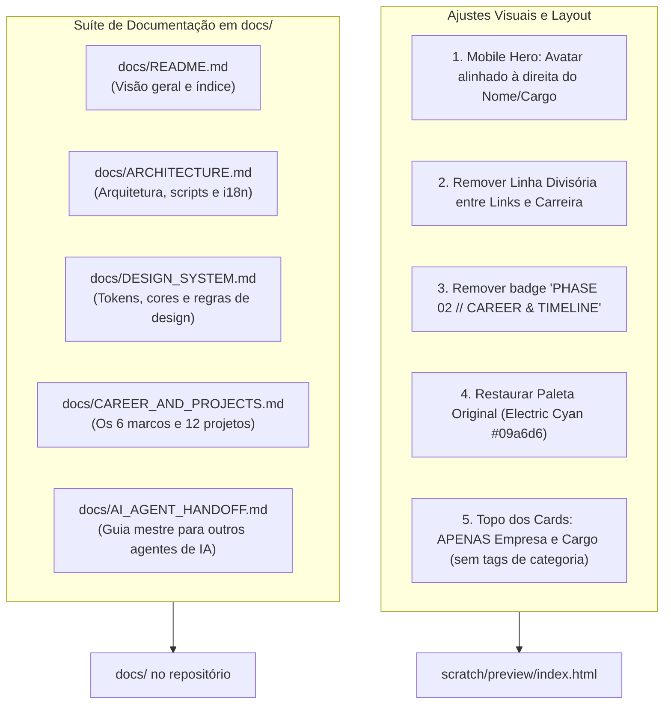

# 📐 Implementation Plan: Refinamentos Mobile, Cards Limpos (Apenas Empresa & Cargo), Remoção de Linha/Badge, Restauração de Cores & Criação do `@docs`

Este plano técnico atualizado atende minuciosamente a todas as solicitações do usuário:
1. **Apenas Empresa & Cargo nos Cards:** Simplificar o topo de cada card de carreira para conter exclusivamente o nome da empresa e o cargo do usuário (eliminando tags como `SaaS Platform`, `High-Concurrency Core`, etc.).
2. **Foto de Perfil à Direita no Mobile:** Posicionar o avatar no canto superior direito no mobile (`< 640px`), ao lado do nome e cargo.
3. **Remoção da Linha Divisória e do Badge "PHASE 02":** Transição contínua e sem linha horizontal entre o botão de links e o título `Where I've Worked & What I Built`.
4. **Restauração da Paleta Original (Electric Cyan / Azul Cósmico):** Reverter as cores roxas para o **Electric Cyan (`#09a6d6`)** original, com superfícies de obsidiana cósmica e LED pulsante ciano.
5. **Suíte Completa de Documentação em `docs/`:** Criação da pasta `docs/` na raiz do projeto com 5 documentos completos preparados para integração imediata com outros agentes de IA.

---

## 🎯 1. Mapa Geral de Mudanças



---

## 📋 2. Detalhamento dos Componentes

### Componente 1: Topo dos Cards de Carreira (Apenas Empresa & Cargo)
- **O que mudar:** Conforme indicado pelo usuário no screenshot, remover as tags extras de categoria (`SaaS Platform`, `High-Concurrency Core`, `Bare-Metal Infrastructure`, `Distributed Microservices`, `High-Concurrency City`, `Genesis · 4-Year Production`).
- **Novo layout do cabeçalho de cada card:**
  ```html
  <!-- Topo simplificado: Apenas Cargo e Nome da Empresa (e o período à direita) -->
  <div class="flex flex-wrap items-center justify-between gap-2 pb-3 border-b border-zinc-800/70">
    <div class="flex items-center gap-3">
      <span class="px-2.5 py-0.5 rounded-md bg-[#09a6d6]/10 border border-[#09a6d6]/30 text-[#09a6d6] text-xs font-mono font-bold" data-i18n="barber_role">Co-Founder</span>
      <span class="text-white font-bold text-sm sm:text-base">BarberGrid</span>
    </div>
    <span class="text-xs font-mono text-zinc-400" data-i18n="barber_period">Jun 2026 — Present</span>
  </div>
  ```

Os 6 marcos simplificados:
1. `[Co-Founder] BarberGrid`
2. `[Software Engineer] Rede Lord`
3. `[Project Manager & Infra Lead] Hive-media`
4. `[Software Engineer] Hive-media`
5. `[FiveM Systems Developer] Refúgio RP`
6. `[Minecraft Systems Developer (Genesis)] Futuremc`

---

### Componente 2: Avatar à Direita no Mobile
- **No mobile (`< 640px`):** O avatar é renderizado no **canto superior direito**, em linha com o nome ("José Gabriel") e cargo ("Software Engineer").
- **No desktop (`sm:` e acima):** O avatar continua à esquerda, sem alterações estruturais.

```html
<div class="flex flex-col sm:flex-row items-start gap-6 sm:gap-8 w-full lg:max-w-xl xl:max-w-2xl min-w-0 flex-1">
  <!-- Desktop Avatar: oculto no mobile -->
  <div class="hidden sm:block relative group shrink-0">
    
    <span class="absolute bottom-1 right-1 w-4 h-4 rounded-full bg-emerald-500 border-2 border-zinc-950 shadow-md"></span>
  </div>

  <div class="space-y-4 w-full min-w-0 flex-1">
    <!-- Bloco de Nome + Avatar Mobile na Direita -->
    <div class="flex items-start justify-between gap-4 w-full">
      <div class="space-y-2 min-w-0 flex-1">
        <div class="flex flex-wrap items-center gap-2.5">
          <h1 class="text-3xl sm:text-4xl lg:text-5xl font-bold font-display text-white tracking-tight">José Gabriel</h1>
          <span class="inline-flex items-center gap-1.5 px-2 py-0.5 rounded-md bg-zinc-900/90 border border-zinc-700/80 text-[11px] font-mono text-zinc-300 shadow-sm">
            <span class="text-blue-400 font-semibold">AKA</span>
            <span class="text-zinc-100 font-bold">zkingboos</span>
          </span>
        </div>
        <div class="space-y-1 pt-0.5">
          <div class="font-archivo text-xl sm:text-3xl md:text-4xl font-extrabold tracking-[-0.035em] text-white">
            <span data-i18n="hero_role_title">Software Engineer</span>
          </div>
          <div class="subtitle-wrapper text-xs sm:text-sm font-mono">
            <div id="rotating-subtitle-container" class="w-full flex items-center"></div>
          </div>
        </div>
      </div>

      <!-- Avatar exclusivo do Mobile alinhado à direita -->
      <div class="sm:hidden relative group shrink-0 mt-0.5">
        
        <span class="absolute bottom-1 right-1 w-3.5 h-3.5 rounded-full bg-emerald-500 border-2 border-zinc-950 shadow-md"></span>
      </div>
    </div>
    ...
```

---

### Componente 3: Remoção da Linha Divisória e do Badge "PHASE 02"
- **Remover:** A classe `border-b border-zinc-800/80 pb-16` da seção hero. Ajustar para `pb-6`, permitindo fluxo suave.
- **Remover:** `<span class="text-xs font-mono uppercase tracking-widest text-[#09a6d6] font-bold"><span data-i18n="phase2_badge">PHASE 02 // CAREER & TIMELINE</span></span>` e o chip ao lado.
- **Resultado:** A página flui naturalmente do botão de links direto para o título:
  ```html
  <h2 class="text-2xl sm:text-3xl font-bold font-display text-white mt-1" data-i18n="phase2_title">Where I've Worked & What I Built</h2>
  ```

---

### Componente 4: Restauração da Paleta Original (Electric Cyan / Azul Cósmico)
Reverter o roxo de volta para a paleta original calibrada com a foto de Paweł Czerwiński:
- **Acento Primário:** `Electric Cyan (#09a6d6)`
- **Hover & Glow:** `#0ca9cf` e `rgba(9, 166, 214, 0.38)`
- **Secundário:** `#0177b1` (Azure) e `#00539c` (Cobalt)
- **Superfícies:** `#06070b` e `#070c16` (Obsidiana)
- **LED do Botão Links:** Ciano pulsante (`bg-[#09a6d6]`)
- **Foco `:target` do Lenis:** Glow em ciano elétrico (`rgba(9, 166, 214, 0.5)`)
- **Backdrop:** Remover o overlay roxo, mantendo a imagem cósmica limpa com fade em preto.

---

### Componente 5: Criação da Pasta `@docs` com Suíte Completa
Criar o diretório `docs/` na raiz do projeto com 5 documentos estruturados:

1. **`docs/README.md`**: Índice da documentação e guia de inicialização.
2. **`docs/ARCHITECTURE.md`**: Arquitetura da aplicação (SPA, Tailwind, Lenis Momentum Scroll, i18n em tempo real, LiveReload).
3. **`docs/DESIGN_SYSTEM.md`**: Tokens de cores (Electric Cyan `#09a6d6`, superfícies obsidiana), fontes (Archivo, Inter, JetBrains Mono, Space Grotesk) e a **Regra Estrita de Zero Emojis**.
4. **`docs/CAREER_AND_PROJECTS.md`**: Dossiê completo dos 6 marcos de carreira e 12 projetos técnicos entregues.
5. **`docs/AI_AGENT_HANDOFF.md`**: Guia mestre pronto para ser consumido por qualquer agente de IA subsequente, com histórico de requisitos e contexto completo.

---

## 🧪 3. Plano de Verificação

### Testes Automatizados
```bash
# 1. Checagem de 0 emojis em todo o arquivo
python3 -c '
import re
with open("scratch/preview/index.html") as f: text = f.read()
emojis = re.findall(r"[\U0001F600-\U0001F64F]|[\U0001F300-\U0001F5FF]|[\U0001F680-\U0001F6FF]|[\U0001F1E0-\U0001F1FF]", text)
assert len(emojis) == 0, f"Emojis detectados: {emojis}"
print("0 emojis: OK!")
'

# 2. Validação sintática de tags HTML com StrictHTMLParser
python3 -c '
from html.parser import HTMLParser
# Validar se todas as tags foram fechadas corretamente
'

# 3. Verificação da existência dos 5 arquivos na pasta docs/
ls -la docs/*.md

# 4. Status do servidor local
curl -sI http://localhost:3000
```

### Verificação Manual
1. Abrir `http://localhost:3000` em viewport mobile e validar o avatar alinhado à direita de "José Gabriel".
2. Conferir que os cabeçalhos dos cards de carreira exibem **apenas o nome da empresa e o cargo** (sem tags como `SaaS Platform`).
3. Validar a remoção da linha divisória e do badge `PHASE 02`.
4. Validar o retorno da paleta Electric Cyan original.
5. Validar a leitura e completude dos arquivos criados em `docs/`.
