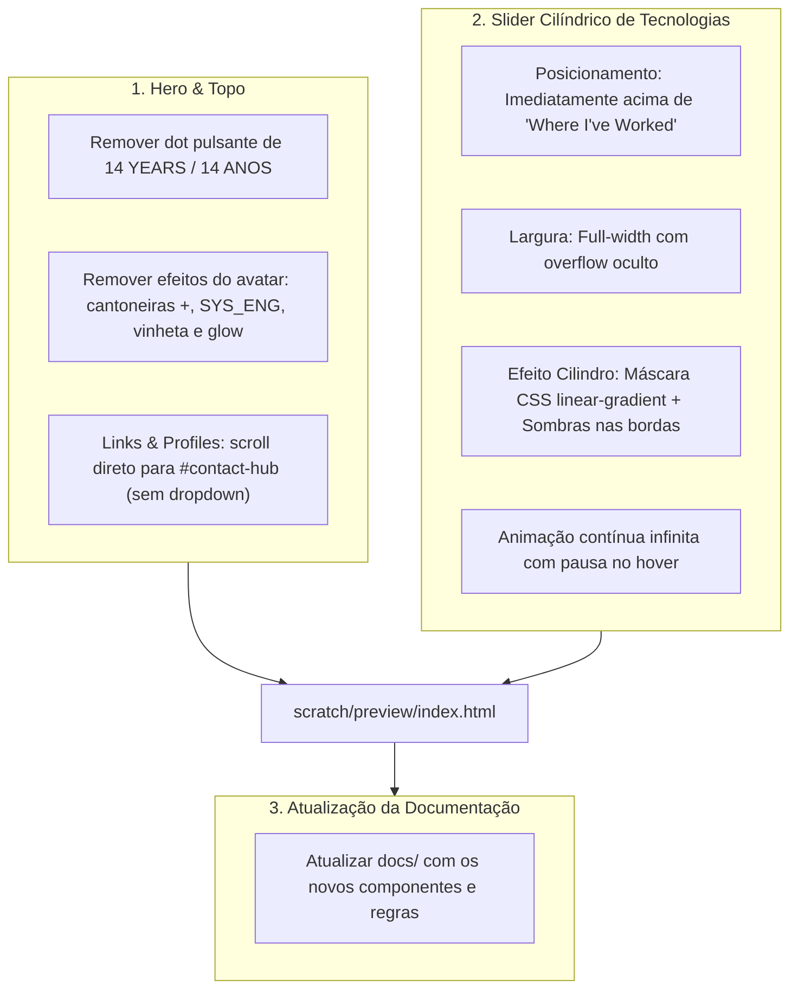

# 📐 Implementation Plan: Slider Cilíndrico de Ferramentas, Avatar Clean, Remoção de Dot & Links para o Rodapé

Este plano técnico consolida todas as 4 solicitações alinhadas diretamente com o usuário:

1. **Slider Cilíndrico de Ferramentas (Full-Width)**:
   - Um carrossel/marquee infinito ocupando toda a largura da tela, posicionado imediatamente acima de *"Where I've Worked & What I Built"*.
   - **Efeito Visual de Cilindro 3D**: As ferramentas deslizam de ponta a ponta e somem suavemente nas bordas através de máscaras gradientes escuras laterais (`mask-image` com fade-out gradual e sombras de curvatura), dando a sensação exata de dar a volta em um cilindro.
2. **Avatar Clean (Sem Efeitos Artificiais)**:
   - Remoção de todos os efeitos artificiais da foto (cantoneiras `+`, texto `SYS_ENG // ACTIVE`, vinheta inferior escura e glow de fundo).
   - A foto volta a ser pura, nítida e natural, com sua borda sutil e cantos arredondados.
3. **Remoção do Dot no Topo**:
   - Remoção da bolinha pulsante (`bg-[#09a6d6] animate-pulse`) do texto `14 YEARS OF SOFTWARE ENGINEERING EXPERIENCE` / `14 ANOS DE EXPERIÊNCIA`, deixando a linha tipográfica limpa.
4. **Redirecionamento Direto de "Links & Profiles"**:
   - O botão "Links & Profiles" no Hero agora rola a página suavemente para o rodapé (`#contact-hub`), onde já residem todos os cartões de contato, e-mail com 1-click copy, currículo em PDF e perfis sociais.
   - O menu dropdown flutuante é eliminado, simplificando a interface e tornando a navegação mais intuitiva.

---

## 🎯 1. Mapa de Mudanças



---

## 📋 2. Detalhamento dos Componentes

### Componente 1: Topo Clean (Sem Dot)
- **Linha:** 271 em `scratch/preview/index.html`.
- **Alteração:** Remover `<span class="w-2 h-2 rounded-full bg-[#09a6d6] animate-pulse"></span>`.
- **Resultado:**
```html
<div class="flex items-center justify-between text-xs font-mono text-zinc-400 border-b border-zinc-800/60 pb-3">
  <span class="text-zinc-200 font-bold tracking-wide font-mono" data-i18n="hero_experience_tag">
    14 ANOS DE EXPERIÊNCIA EM ENGENHARIA DE SOFTWARE
  </span>
  <div class="flex items-center gap-3">
    <span>Brasil & UK</span>
    <span class="text-zinc-600 hidden sm:inline">·</span>
    <span class="text-emerald-400 font-bold hidden sm:inline" id="live-clock">--:-- BRT</span>
    <span class="text-zinc-600 hidden sm:inline">·</span>
    <span class="text-zinc-300">Available Globally</span>
  </div>
</div>
```

---

### Componente 2: Avatar Clean (Foto Natural sem Efeitos)
- **O que remover:** Cantoneiras `+`, vinheta escura inferior, texto `SYS_ENG // ACTIVE` e camada de glow.
- **Resultado Desktop:**
```html
<div class="hidden sm:block relative group shrink-0">
  
</div>
```
- **Resultado Mobile:**
```html
<div class="sm:hidden relative group shrink-0 mt-0.5">
  
</div>
```

---

### Componente 3: Botão "Links & Profiles" Redirecionando para o Rodapé
Substituir o wrapper com dropdown por um link direto de alta fidelidade que aciona o scroll suave do Lenis até a seção `#contact-hub`:
```html
<div class="pt-3">
  <a 
    href="#contact-hub" 
    class="group inline-flex items-center gap-2.5 px-4 py-2.5 rounded-xl bg-[#070c16]/90 hover:bg-[#0b1626] border border-[rgba(9,166,214,0.35)] hover:border-[#09a6d6] text-zinc-100 font-mono text-xs font-semibold backdrop-blur-xl shadow-[0_4px_20px_rgba(0,0,0,0.6),0_0_15px_rgba(9,166,214,0.12)] hover:shadow-[0_4px_25px_rgba(9,166,214,0.25)] transition-all duration-300 active:scale-[0.98]"
  >
    <!-- Ícone Vetorial de Link em Ciano -->
    <svg class="w-3.5 h-3.5 text-[#09a6d6] group-hover:text-white transition-colors" viewBox="0 0 24 24" fill="none" stroke="currentColor" stroke-width="2" stroke-linecap="round" stroke-linejoin="round">
      <path d="M10 13a5 5 0 0 0 7.54.54l3-3a5 5 0 0 0-7.07-7.07l-1.72 1.71"></path>
      <path d="M14 11a5 5 0 0 0-7.54-.54l-3 3a5 5 0 0 0 7.07 7.07l1.71-1.71"></path>
    </svg>

    <span class="tracking-tight text-white font-medium" data-i18n="hero_links_btn">Links & Profiles</span>
    
    <!-- Seta sutil indicando descida para o rodapé -->
    <span class="text-zinc-500 group-hover:text-[#09a6d6] group-hover:translate-y-0.5 transition-all text-xs">↓</span>
  </a>
</div>
```
O menu flutuante e o script `toggleLinksMenu` são completamente expurgados.

---

### Componente 4: Slider Cilíndrico de Ferramentas (Full-Width)
- **Posição:** Imediatamente antes de `<section class="space-y-6" id="section-career">`.
- **Efeito Visual Cilindro:**
  - Máscara CSS `mask-image`:
    ```css
    mask-image: linear-gradient(to right, transparent 0%, rgba(0,0,0,0.3) 4%, rgba(0,0,0,1) 14%, rgba(0,0,0,1) 86%, rgba(0,0,0,0.3) 96%, transparent 100%);
    -webkit-mask-image: linear-gradient(to right, transparent 0%, rgba(0,0,0,0.3) 4%, rgba(0,0,0,1) 14%, rgba(0,0,0,1) 86%, rgba(0,0,0,0.3) 96%, transparent 100%);
    ```
  - Sombras de curvatura nas extremidades simulam o objeto dobrando-se no horizonte de um cilindro 3D.
  - Animação contínua linear de 35 segundos com pausa ao passar o mouse.
- **Ferramentas Inclusas (20 Stacks):**
  `Go (Golang)`, `Java`, `Kotlin`, `TypeScript`, `Python`, `Lua`, `Docker`, `Proxmox VE`, `Ceph`, `Apache Kafka`, `BullMQ`, `Redis`, `PostgreSQL`, `MySQL`, `Terraform`, `Tailscale`, `Linux`, `Hono`, `Minestom`, `ViaVersion`.

---

## 🧪 3. Plano de Verificação

### Automated Tests
```bash
# 1. Checagem de ausência total de emojis
python3 -c '
import re
with open("scratch/preview/index.html") as f: text = f.read()
emojis = re.findall(r"[\U0001F600-\U0001F64F]|[\U0001F300-\U0001F5FF]|[\U0001F680-\U0001F6FF]|[\U0001F1E0-\U0001F1FF]", text)
assert len(emojis) == 0, f"Emojis encontrados: {emojis}"
print("Zero emojis verificado!")
'

# 2. Checagem de validação sintática do HTML (StrictHTMLParser)
python3 -c '
from html.parser import HTMLParser
# Validar unclosed tags == 0
'

# 3. Validar remoções (sem dot no topo, sem SYS_ENG, sem menu dropdown flutuante)
python3 -c '
with open("scratch/preview/index.html") as f: c = f.read()
assert "hero_experience_tag" in c
assert "SYS_ENG" not in c
assert "btn-links-toggle" not in c
assert "href=\"#contact-hub\"" in c
print("Remoções e link para #contact-hub validados com sucesso!")
'

# 4. Status do Webserver Local
curl -sI http://localhost:3000
```

### Manual Verification
1. Abrir `http://localhost:3000`.
2. Conferir o topo: texto limpo de 14 Anos sem nenhuma bolinha.
3. Conferir a foto: natural, limpa, com borda sutil original.
4. Clicar em "Links & Profiles": a tela desliza suavemente até o rodapé (`#contact-hub`) onde estão os botões de contato.
5. Observar o slider de ferramentas logo acima de "Where I've Worked & What I Built", deslizando suavemente de ponta a ponta e sumindo nas bordas como um cilindro.
