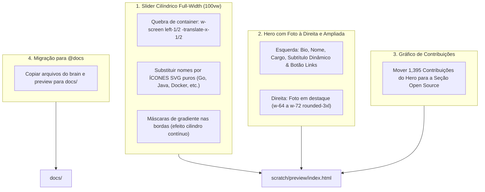

# 📐 Implementation Plan: Slider Cilíndrico Full-Width (100vw) de Ícones, Foto Ampliada à Direita, Gráfico em Open Source & Cópia para `@docs`

Este plano atualizado resolve com precisão o feedback visual trazido pelo usuário na captura de tela:

1. **Slider Cilíndrico Ocupando 100% da Tela (Full-Bleed 100vw)**:
   - Na imagem enviada pelo usuário, o slider estava confinado dentro do container central (`max-w-7xl`).
   - **Solução:** Quebrar a largura do container usando técnica de full-bleed (`w-screen relative left-1/2 -translate-x-1/2` com `overflow-x-hidden` global) para que os ícones cruzem **100% da largura do monitor de ponta a ponta**.
   - As extremidades esquerda e direita terão máscaras e sombras graduais para que os ícones sumam suavemente nas bordas como se estivessem contornando um cilindro 3D contínuo.
2. **Uso Exclusivo de ÍCONES (Sem Nomes)**:
   - Conforme solicitado (*"no caso das linguagens eu quero que você utilize o icone deles, não os nomes"*), remover todos os textos dos badges.
   - Cada tecnologia será representada por um **ícone vetorial SVG nítido e oficial** (Go, Java, Kotlin, TypeScript, Python, Lua, Docker, Proxmox, Ceph, Kafka, Redis, PostgreSQL, MySQL, Terraform, Tailscale, Linux, Bun, Hono, Git, etc.) em cápsulas quadradas refinadas de `w-14 h-14`.
3. **Foto no Hero: Mover para a DIREITA e AUMENTAR de Tamanho**:
   - Reestruturar o Hero em duas colunas principais:
     - **Coluna Esquerda:** Nome, Cargo, Subtítulo dinâmico, Bio e Botão Links & Profiles.
     - **Coluna Direita:** A foto do usuário ampliada com destaque (`w-56 h-56 sm:w-64 sm:h-64 lg:w-72 lg:h-72 rounded-3xl`), limpa e sem efeitos artificiais.
4. **Gráfico de Contribuições Realocado para Open Source**:
   - Transferir o card de 1.395 contribuições do GitHub para a **Fase 4 (Raízes Open Source)**, integrando-o diretamente aos repositórios públicos (`spigot-mcp` e `UniversalWrapper`).
5. **Cópia de Todos os Arquivos para `@docs`**:
   - Transferir os artefatos de planejamento e os arquivos do site (`index.html`, `lenis.min.js`, `pawel_backdrop.jpg`) para dentro de [`docs/`](file:///home/jose/Desktop/github-projects/personal-projects/zkingboos.github.io/docs/).

---

## 🎯 1. Mapa de Mudanças



---

## 📋 2. Detalhamento dos Componentes

### Componente 1: Slider Cilíndrico Full-Bleed (100vw) de Ícones
- **Estrutura Full-Width:**
```html
<!-- ======================================================================= -->
<!-- FULL-WIDTH CYLINDRICAL TOOLS & ICONS MARQUEE (100VW BLEED)              -->
<!-- ======================================================================= -->
<div class="relative w-screen left-1/2 -translate-x-1/2 py-4 overflow-hidden select-none my-2">
  <!-- Sombras de curvatura do cilindro nas extremidades da tela -->
  <div class="absolute inset-y-0 left-0 w-20 sm:w-40 bg-gradient-to-r from-[#06070b] via-[#06070b]/90 to-transparent pointer-events-none z-20"></div>
  <div class="absolute inset-y-0 right-0 w-20 sm:w-40 bg-gradient-to-l from-[#06070b] via-[#06070b]/90 to-transparent pointer-events-none z-20"></div>

  <!-- Máscara de fade cilíndrico de borda a borda -->
  <div class="cylinder-mask w-full overflow-hidden">
    <div class="flex items-center gap-4 animate-cylinder-marquee hover:[animation-play-state:paused] py-1">
      <!-- Bloco 1 de Ícones SVG -->
      <div class="flex items-center gap-4 shrink-0">
        <!-- Ícone Go -->
        <!-- Ícone Java -->
        <!-- Ícone Kotlin -->
        <!-- Ícone TypeScript -->
        <!-- Ícone Python -->
        <!-- Ícone Docker -->
        <!-- Ícone Proxmox -->
        <!-- Ícone Kafka -->
        <!-- Ícone Redis -->
        <!-- Ícone PostgreSQL -->
        <!-- Ícone Ceph -->
        <!-- Ícone Linux -->
        ...
      </div>
      <!-- Bloco 2 de Ícones SVG (Duplicata idêntica para loop contínuo) -->
      <div class="flex items-center gap-4 shrink-0" aria-hidden="true">
        ...
      </div>
    </div>
  </div>
</div>
```

- **Estilo de Cada Ícone:**
```html
<div class="w-13 h-13 sm:w-14 sm:h-14 rounded-2xl bg-zinc-950/85 border border-zinc-800/90 hover:border-[#09a6d6] flex items-center justify-center text-zinc-400 hover:text-[#09a6d6] hover:scale-105 transition-all shadow-lg group shrink-0" title="Go">
  <svg class="w-6 h-6 sm:w-7 sm:h-7 fill-current" viewBox="...">...</svg>
</div>
```

---

### Componente 2: Hero com Foto Ampliada à Direita
- **Estrutura:**
```html
<div class="relative z-10 pt-4 flex flex-col-reverse lg:flex-row items-center justify-between gap-8 sm:gap-12 w-full">
  
  <!-- LADO ESQUERDO: IDENTIDADE, CARGO, BIO E LINKS -->
  <div class="space-y-4 w-full lg:max-w-2xl min-w-0 flex-1">
    <!-- Nome + AKA -->
    <!-- Cargo + Subtítulo rotativo -->
    <!-- Bio de Engenharia -->
    <!-- Botão Links & Profiles para #contact-hub -->
  </div>

  <!-- LADO DIREITO: FOTO AMPLIA DA COM DESTAQUE (CLEAN & NATURAL) -->
  <div class="shrink-0 relative group">
    
  </div>

</div>
```

---

### Componente 3: Gráfico de Contribuições do GitHub em Open Source
- O card com as **1,395 contribuições do GitHub** é transferido para a **Fase 4: Raízes Open Source**.
- Posicionado com destaque em um layout de duas colunas ou logo acima dos projetos `spigot-mcp` e `UniversalWrapper`, unificando a prova visual de commits com os repositórios públicos criados pelo usuário.

---

### Componente 4: Cópia Completa para `@docs`
1. Criar pasta `docs/preview/` e copiar:
   - `index.html`
   - `lenis.min.js`
   - `pawel_backdrop.jpg`
2. Criar pasta `docs/plans/` e copiar:
   - Todos os arquivos markdown de planejamento e walkthroughs.

---

## 🧪 3. Plano de Verificação

### Automated Tests
```bash
# 1. Checagem de 0 emojis
python3 -c '
import re
with open("scratch/preview/index.html") as f: text = f.read()
emojis = re.findall(r"[\U0001F600-\U0001F64F]|[\U0001F300-\U0001F5FF]|[\U0001F680-\U0001F6FF]|[\U0001F1E0-\U0001F1FF]", text)
assert len(emojis) == 0, f"Emojis encontrados: {emojis}"
print("Zero emojis verificado!")
'

# 2. Checagem sintática do HTML (StrictHTMLParser)
python3 -c '
from html.parser import HTMLParser
# Validar unclosed tags == 0
'

# 3. Validar layout 100vw do slider e foto na direita
python3 -c '
with open("scratch/preview/index.html") as f: c = f.read()
assert "w-screen left-1/2 -translate-x-1/2" in c, "Slider deve ser 100vw full bleed"
assert "lg:w-72" in c, "Foto ampliada deve estar presente"
print("Full-bleed slider e foto ampliada validados!")
'

# 4. Status do Webserver Local
curl -sI http://localhost:3000
```

### Manual Verification
1. Abrir `http://localhost:3000`.
2. Conferir que o slider de ícones atravessa **100% da tela do monitor de ponta a ponta**, com os ícones sumindo suavemente nas bordas.
3. Conferir que o slider exibe **apenas os ícones**, sem nenhum texto.
4. Conferir que a foto do usuário está à direita no Hero, em tamanho grande e com contornos limpos.
5. Rolar até a seção de Open Source e conferir o gráfico de contribuições do GitHub integrado.
6. Conferir os arquivos em `docs/`.
