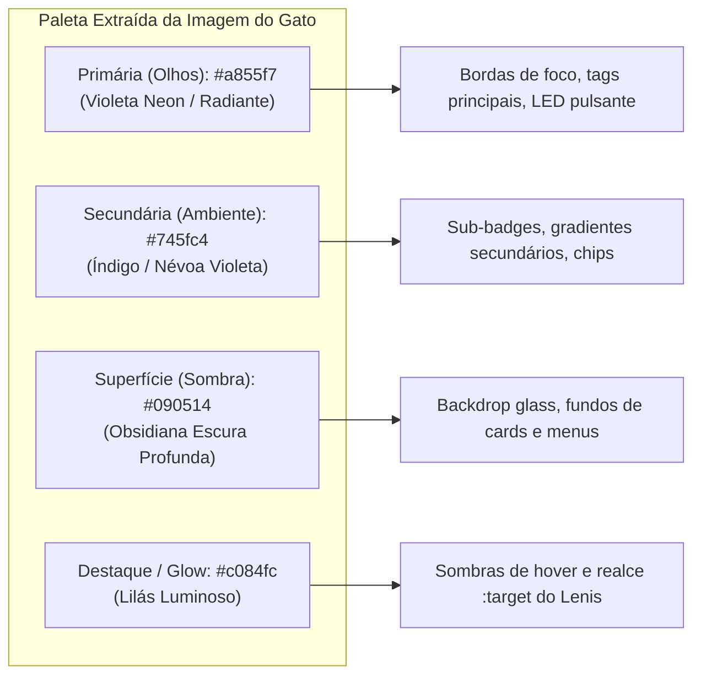

# 📐 Implementation Plan: Redesign Minimalista da Trajetória, Remoção Total de Emojis & Rebrand Roxo/Índigo (Paleta do Gato)

Este plano aborda de ponta a ponta as solicitações do usuário para modernizar o portfólio, eliminando ruídos visuais, descartando elementos caricatos (terminal e emojis) e estabelecendo a identidade visual premium com as cores exatas da foto enviada.

---

## 🎯 1. Objetivos e Escopo

1. **Rebrand da Paleta de Cores (Cores Extraídas da Imagem do Gato):**
   - **Cor Primária:** Roxo Radiante / Violeta Elétrico (**`#a855f7`** / **`#b546ff`** / **`#c084fc`**), extraído do brilho dos olhos do gato.
   - **Cor Secundária:** Violeta Atmosférico / Índigo Profundo (**`#745fc4`** / **`#5c3d99`** / **`#4a2d82`**), extraído da névoa de iluminação ao redor do gato.
   - **Superfície Base:** Obsidiana Escura com matiz violeta profundo (**`#090514`** / **`#0e081d`** / **`#130c24`**).
   - Substituição de todos os acentos ciano elétrico (`#09a6d6`), azul e âmbar pelos tons primários e secundários de roxo.

2. **Redesign da FASE 02 (Trajetória & Linha do Tempo):**
   - ❌ **Remover o visual de Terminal:** Eliminar a barra Mac de topo (botões vermelho, amarelo e verde) e o prompt falso (`jose@archlinux: ~/career-engine $ git log ...`).
   - ❌ **Remover os "Points" Laterais:** Eliminar os círculos coloridos com anéis luminosos e as linhas verticais conectadas (`* |`) que poluiam a lateral esquerda.
   - ❌ **Remover "Abrir <nome do projeto>" e setas `↗`:** Descartar o padrão de botão com comando imperativo e ícones de seta externos. Exibir apenas tags sutis dos projetos ou integrá-los de forma minimalista na ficha técnica.
   - ✨ **Novo Layout de Cards de Engenharia:** Cards modernos, limpos e responsivos no estilo *Staff Engineer / Tech Lead* (inspirados em Linear e Vercel), com hierarquia clara entre papel, período, mandato técnico e stack.

3. **Expurgo Total de Emojis em Todo o Site:**
   - Remoção rigorosa de **100% dos emojis** em todo o arquivo HTML, scripts e dicionários i18n.
   - Substituição de bandeiras (`🇺🇸`, `🇧🇷`), envelopes (`✉️`), pins (`📍`), estrelas (`★`), caixas (`📦`), raios (`⚡`), escudos (`🛡️`), monstros (`👾`), árvores (`🌳`), foguetes (`🚀`), etc., por tipografia técnica limpa ou SVGs inline monocromáticos.

---

## 🎨 2. Paleta de Cores Extraída da Foto do Gato



| Elemento | Valor Antigo | Novo Valor (Paleta do Gato) |
|---|---|---|
| **Acento Primário** | `#09a6d6` (Electric Cyan) | **`#a855f7`** (Electric Purple) / **`#c084fc`** |
| **Acento Secundário** | `#00437f` (Cobalt Azure) | **`#745fc4`** (Atmospheric Velvet Indigo) |
| **Backing Superfícies** | `#06070b` / `#070c16` | **`#090514`** / **`#0e081d`** |
| **Bordas Ativas / Hover** | `border-[#09a6d6]` | **`border-purple-500/50`** / **`hover:border-purple-400`** |
| **Pulsing Status LED** | `#09a6d6` (Cyan LED) | **`#a855f7`** (Purple Neon LED) |
| **Target Glow (`:target`)**| `rgba(9, 166, 214, 0.45)` | **`rgba(168, 85, 247, 0.45)`** |

---

## 📋 3. Estrutura Proposta para os Cards da Fase 02

Adeus formato de terminal. Olá cards de arquitetura limpa:

```html
<!-- Exemplo de Card Proposto para a Fase 02 -->
<div class="bg-[#0e081d]/80 border border-purple-900/30 hover:border-purple-500/50 rounded-2xl p-5 sm:p-6 transition-all duration-300 hover:shadow-[0_0_25px_rgba(168,85,247,0.12)] group">
  <!-- Top: Role Badge & Period -->
  <div class="flex flex-wrap items-center justify-between gap-2 pb-3 border-b border-zinc-800/60">
    <div class="flex items-center gap-2.5">
      <span class="px-2.5 py-0.5 rounded-md bg-purple-950/70 border border-purple-800/60 text-purple-300 text-xs font-mono font-bold">Co-Founder</span>
      <span class="text-white font-semibold text-sm">BarberGrid</span>
    </div>
    <span class="text-xs font-mono text-zinc-400">Jun 2026 — Present</span>
  </div>

  <!-- Body: Mandate & Description -->
  <div class="pt-3 space-y-2">
    <h3 class="text-white font-semibold text-sm sm:text-base">Multi-tenant barbershop architecture & OpenAPI contracts</h3>
    <p class="text-zinc-300 text-xs sm:text-sm leading-relaxed">
      Led the backend architecture for a multi-tenant barbershop SaaS, establishing engineering standards (OpenAPI-first and observability) and collaborating cross-functionally to ship reliable, compliant features.
    </p>
  </div>

  <!-- Footer: Tech Stack & Project Identification (Sem "Abrir" e Sem Seta "↗") -->
  <div class="pt-4 mt-2 border-t border-zinc-800/50 flex flex-wrap items-center justify-between gap-2">
    <div class="flex flex-wrap items-center gap-1.5 text-xs text-zinc-400">
      <span class="px-2 py-0.5 rounded bg-zinc-900/90 border border-zinc-800 text-zinc-300">Go (Golang)</span>
      <span class="px-2 py-0.5 rounded bg-zinc-900/90 border border-zinc-800 text-zinc-300">OpenAPI</span>
      <span class="px-2 py-0.5 rounded bg-zinc-900/90 border border-zinc-800 text-zinc-300">Docker</span>
      <span class="px-2 py-0.5 rounded bg-zinc-900/90 border border-zinc-800 text-zinc-300">PostgreSQL</span>
      <span class="px-2 py-0.5 rounded bg-zinc-900/90 border border-zinc-800 text-zinc-300">Observability</span>
    </div>
    <a href="#project-barbergrid" class="text-xs font-mono text-purple-400 hover:text-purple-300 font-medium transition-colors">
      BarberGrid SaaS
    </a>
  </div>
</div>
```

---

## 🚫 4. Tabela de Remoção Rigorosa de Emojis

| Localização no Código | Elemento Anterior (Com Emoji) | Novo Elemento (Limpo / Sem Emoji) |
|---|---|---|
| **Botão de Idioma** | `<span>🌐</span> <span>EN 🇺🇸</span>` | `<span>EN</span> / <span>PT</span>` |
| **Botão Contato Nav** | `<span>✉️</span> <span>Get in Touch</span>` | `<svg ...> <span>Get in Touch</span>` ou texto puro |
| **Subheader Geo** | `<span>📍 Brasil & UK</span>` | `<span>Brasil & UK</span>` |
| **Menu de Links** | `<span>✉</span>`, `<span>📄</span>`, `<span>⌥</span>` | Ícones SVG monocromáticos limpos |
| **Botões de Projetos F2** | `📦 Abrir BarberGrid SaaS ↗`, `⚡ Abrir ... ↗`, etc. | Nome limpo do sistema: `BarberGrid SaaS`, `Rede Lord Core` (sem "Abrir" e sem `↗`) |
| **Fase 02 Header** | `🌳 CAREER GIT DAG VISUALIZER` | `CAREER & TIMELINE // PRODUCTION MILESTONES` |
| **Estrelas de Reviews** | `<span>★★★★★</span>` | `5.0 / 5.0 Rating` ou SVGs de estrelas minimalistas |
| **Cards de Contato** | `📍 Localização`, `🕒 Fuso`, `✉️ Email`, `📋 Copiar`, `📄 CV`, `⚡ Resposta` | Tipografia técnica com rótulos mono limpos |
| **Chips de Infra** | `🛡️ Zero Single...`, `⚡ Desacoplamento`, `🖥️ Soberania`, `📊 Latência` | Tags limpas sem emojis |
| **JS Toast Copiado** | `Copiado! ✓` | `Copiado` |

---

## 🔍 5. Arquivos a Serem Modificados

#### [MODIFY] [index.html](file:///home/jose/.gemini/antigravity-cli/brain/8e217752-9320-4fe7-8dcf-fc009f4d0c47/scratch/preview/index.html)
1. **Paleta de Cores e Estilos Globais:**
   - Inserir variáveis CSS `--color-primary: #a855f7`, `--color-secondary: #745fc4`, `--bg-surface: #0e081d`.
   - Atualizar `:target` glow de ciano para roxo (`box-shadow: 0 0 35px rgba(168,85,247,0.45); border-color: #a855f7`).
   - Atualizar o botão de links `#btn-links-toggle` e menu `#links-menu` para o tema roxo/violeta.
2. **Reestruturação da FASE 02 (`#section-career`):**
   - Substituir o wrapper de terminal Mac por uma lista moderna de 6 cards de marcos técnicos.
   - Remover os nós e conectores laterais (`flex flex-col items-center shrink-0 w-8`).
   - Remover "Abrir <projeto>" e setas `↗`.
3. **Varredura e Limpeza de Emojis:**
   - Substituir todos os emojis encontrados pelas alternativas tipográficas limpas.
   - Atualizar strings no dicionário JavaScript `i18n` para eliminar emojis.

---

## 🧪 6. Plano de Verificação

### Automated Tests
1. **Varredura Regex de Emojis:**
   ```bash
   python3 -c '
   import re
   with open("scratch/preview/index.html") as f: content = f.read()
   emojis = re.findall(r"[\U00010000-\U0010ffff]|[\u2600-\u27bf]|[\u2300-\u23ff]", content)
   assert len(emojis) == 0, f"Ainda existem {len(emojis)} emojis no site: {set(emojis)}"
   print("0 emojis encontrados! 100% limpo.")
   '
   ```
2. **Validação Estrutural de HTML:**
   ```bash
   python3 -c '
   from html.parser import HTMLParser
   # Validar ausência de tags órfãs ou descasadas
   '
   ```
3. **Saúde do Servidor Preview:**
   ```bash
   curl -sI http://localhost:3000
   ```

### Manual Verification
1. Abrir `http://localhost:3000` e conferir a nova atmosfera em roxo/índigo (harmonizada com os olhos e iluminação do gato).
2. Verificar a seção da Fase 02: sem terminal, sem pontinhos laterais feios, com cards limpos e sem o texto "Abrir" ou setas `↗`.
3. Conferir a ausência total de emojis na barra de navegação, cabeçalho, botões, chips e seção de contato.
